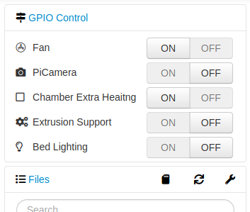
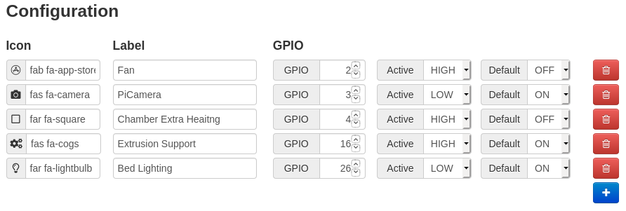

# OctoPrint GPIO Control

This is Plugowski's port of catgiggle's GPIO Control with a shim by oldmanbluntz to use the FT232H USB Breakout Board with standard RPi.GPIO code. The original plugin is here.

https://github.com/catgiggle/OctoPrint-GpioControl

Plugowski's is here, it fixes a few issues with the on and off button.

https://github.com/plugowski/OctoPrint-GpioControl

GPIO Control adds a sidebar with on/off buttons. You can add as many buttons as you want that will control each device connected to your Raspberry Pi.

Very useful if you want to add some electronic/improvements to your printer.

## Setup

Install via the bundled [Plugin Manager](https://docs.octoprint.org/en/master/bundledplugins/pluginmanager.html)
or manually using this URL:

    https://github.com/oldmanbluntz/OctoPrint-GPIOControlFT232H/archive/master.zip

## Configuration

Just add correct GPIO configuration:

- select icon using icon picker (or typing manually) for better identification
- type name for your device connected to GPIO
- type pin number according to BCM numeration - for more details please [visit this page](https://pinout.xyz/)
- select if device is driven for low or high state of GPIO
    - _active high_ means that device is **on for high state** of GPIO and **off for low state**
    - _active low_ means that device is **on for low state** of GPIO and **off for high state**
- select if device should be on or off by default eg. after startup
